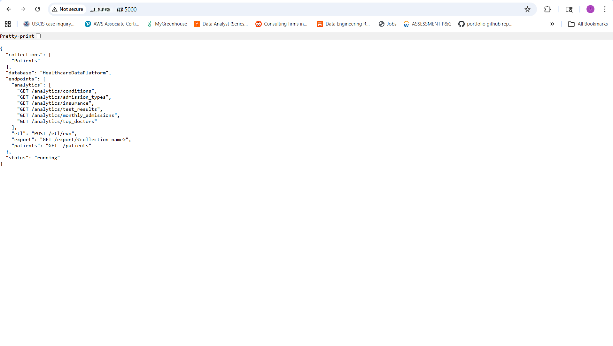
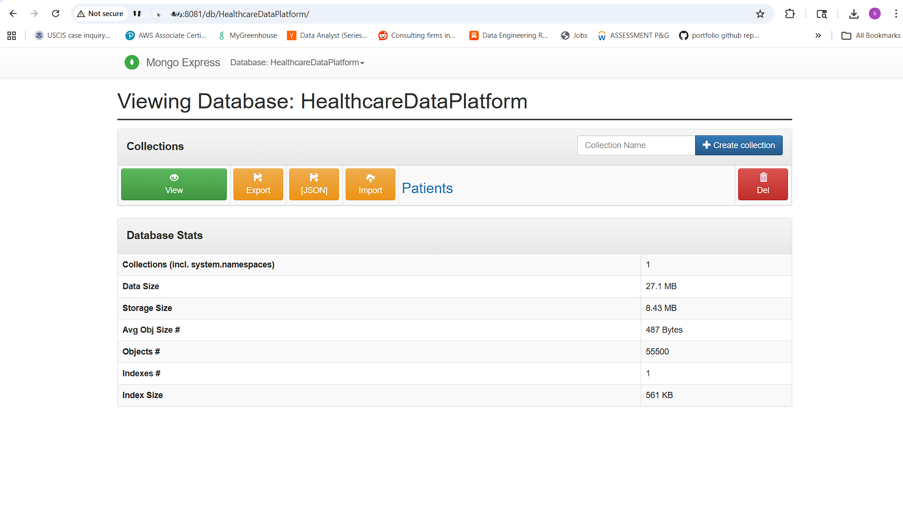
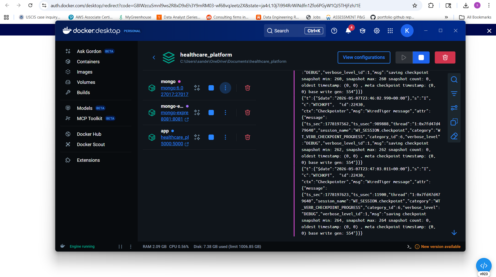
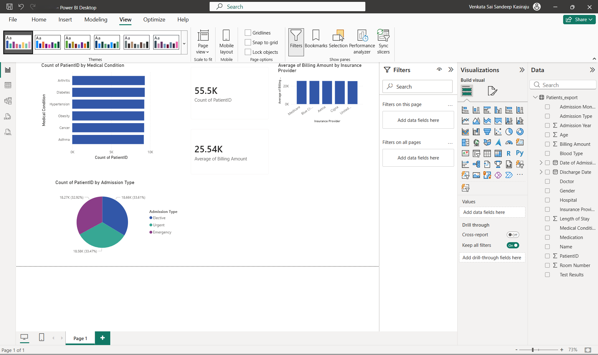

<div align="center">


<br/>
<br/>

# 🏥 Healthcare Data Platform

### A scalable, production-grade EHR analytics platform processing **55,500 patient records**
### with real-time dashboards, cloud deployment, and statistical analysis.

<br/>

[](LICENSE)
[](https://python.org)
[](https://mongodb.com)
[](https://docker.com)

</div>

---

## 📌 Overview

This platform simulates a real-world **Electronic Health Record (EHR) system**, built with a modern data stack. It covers the full data engineering lifecycle — from raw CSV ingestion to cloud-hosted REST APIs, NoSQL storage, distributed analytics, BI dashboards, and statistical validation in R.

> Built to demonstrate production-level data engineering, cloud deployment, and analytics skills across the full stack.

---

## 🏗️ Architecture

```
┌─────────────────────────────────────────────────────────────┐
│                    Healthcare Data Platform                  │
├──────────────┬──────────────┬──────────────┬────────────────┤
│   API Layer  │  ETL / Data  │  Data Layer  │     Cloud      │
│              │  Processing  │              │   Deployment   │
│  Flask REST  │  Pandas ETL  │   MongoDB    │   AWS EC2      │
│  10 endpoints│  Spark Jobs  │  55,500 docs │   Docker       │
└──────────────┴──────────────┴──────────────┴────────────────┘
         │                                          │
         ▼                                          ▼
┌─────────────────┐                    ┌───────────────────────┐
│  Analytics & BI │                    │  Statistical Analysis │
│  Power BI       │                    │  R — ANOVA            │
│  Live Dashboards│                    │  Pearson Correlation  │
│  KPI Monitoring │                    │  Chi-Square Tests     │
└─────────────────┘                    └───────────────────────┘
```

---

## ⚙️ Tech Stack

| Component | Technology | Description |
|---|---|---|
| 🔌 API Layer | Flask, REST API | Data access, ETL trigger, analytics endpoints |
| 🔄 ETL Pipeline | Pandas, Apache Spark | Scalable ingestion, transformation, loading |
| 🗄️ Data Layer | MongoDB | Flexible NoSQL storage for EHR records |
| ☁️ Cloud | AWS EC2, Docker Compose | Container orchestration, cloud hosting |
| 📊 Analytics & BI | Power BI | Real-time dashboards via CSV or live API |
| 📈 Statistics | R, Python | Hypothesis testing, correlation, model validation |

---

## 📂 Dataset

**55,500 patient records** with 15 features across 6 medical conditions.

| Feature | Values |
|---|---|
| Medical Condition | Cancer, Diabetes, Obesity, Hypertension, Arthritis, Asthma |
| Admission Type | Urgent, Emergency, Elective |
| Test Results | Normal, Abnormal, Inconclusive |
| Insurance Provider | Blue Cross, Medicare, Aetna, UnitedHealthcare, Cigna |
| Billing Amount | Range: $0 — $52,764 · Average: $25,539 |
| Length of Stay | Range: 1 — 30 days · Average: 15.5 days |

---

## 🚀 Quick Start

### Option 1 — Run with Docker (Recommended)

```bash
# Clone the repository
git clone https://github.com/Sandeepkasiraju98/Healthcare-Data-Platform.git
cd Healthcare-Data-Platform

# Start all services (Flask + MongoDB + Mongo UI)
docker-compose up --build
```

### Option 2 — Run Locally

```bash
pip install -r requirements.txt
python app.py
```

### Load Data into MongoDB

```bash
# Trigger ETL pipeline to load 55,500 records
curl -X POST http://localhost:5000/etl/run
```

**Expected response:**
```json
{"records_loaded": 55500, "status": "success"}
```

### Access the Platform

| Service | URL |
|---|---|
| 🔌 Flask API | http://localhost:5000 |
| 🗄️ MongoDB UI | http://localhost:8081 |

---

## 📡 API Endpoints

### Patient CRUD

| Method | Endpoint | Description |
|---|---|---|
| `GET` | `/patients` | Get all patients (supports filters) |
| `GET` | `/patients/<id>` | Get single patient by ID |
| `POST` | `/patients` | Insert new patient |
| `PUT` | `/patients/<id>` | Update patient record |
| `DELETE` | `/patients/<id>` | Delete patient record |

### Analytics

| Method | Endpoint | Description |
|---|---|---|
| `GET` | `/analytics/conditions` | Patients by medical condition |
| `GET` | `/analytics/admission_types` | Admission type breakdown |
| `GET` | `/analytics/insurance` | Billing stats by insurance provider |
| `GET` | `/analytics/test_results` | Test results distribution |
| `GET` | `/analytics/monthly_admissions` | Monthly admission trends |
| `GET` | `/analytics/top_doctors` | Top 20 doctors by patient count |

### ETL & Export

| Method | Endpoint | Description |
|---|---|---|
| `POST` | `/etl/run` | Trigger full ETL pipeline |
| `GET` | `/export/<collection>` | Export collection as CSV for Power BI |

### Query Filters

```bash
GET /patients?condition=Cancer
GET /patients?gender=Female
GET /patients?admission_type=Emergency
GET /patients?test_result=Abnormal
GET /patients?limit=50
```

---

## 📊 Power BI Dashboard

Export data directly from the API and visualize in Power BI Desktop:

```
GET http://localhost:5000/export/Patients
```

**Dashboards built:**

| Visual | Fields | Insight |
|---|---|---|
| Bar Chart | Medical Condition vs Count | Most common conditions |
| Pie Chart | Admission Type | Urgent vs Emergency vs Elective |
| Bar Chart | Insurance Provider vs Avg Billing | Cost by insurer |
| Donut Chart | Test Results | Normal / Abnormal / Inconclusive |
| KPI Card | Total Patients | 55,500 |
| KPI Card | Avg Billing Amount | $25,539 |

See [`POWERBI_GUIDE.md`](POWERBI_GUIDE.md) for full setup instructions.

---

## ☁️ Deploy on AWS EC2

```bash
# 1. Launch EC2 instance (Ubuntu 24.04, t2.micro)
# 2. Open ports 22, 5000, 8081 in Security Group

# 3. SSH into instance
ssh -i healthcare-key.pem ubuntu@your-ec2-ip

# 4. Upload project
scp -i healthcare-key.pem -r ./Healthcare-Data-Platform ubuntu@your-ec2-ip:~/

# 5. Run deployment script
bash deploy_ec2.sh
```

Your platform is now live at `http://your-ec2-ip:5000`

---

## 📈 Statistical Analysis (R)

```r
setwd("path/to/Healthcare-Data-Platform")
source("r_analysis/analysis.R")
```

**Statistical tests performed:**

| Test | Variables | Result |
|---|---|---|
| ANOVA | Billing Amount ~ Admission Type | p = 0.752 — no significant difference |
| Pearson Correlation | Age vs Billing Amount | r = -0.004 — no correlation |
| Chi-Square | Medical Condition vs Test Results | p = 0.210 — independent |

**Charts generated:**

| Chart | File |
|---|---|
| Billing Amount by Medical Condition | `billing_by_condition.png` |
| Length of Stay by Admission Type | `stay_by_admission.png` |
| Age Distribution by Gender | `age_distribution.png` |
| Heatmap: Condition vs Test Results | `heatmap_condition_results.png` |
| Admission Type by Condition | `admission_by_condition.png` |

---

## 🔥 Distributed Analytics (Spark)

```bash
python etl/spark_analytics.py
```

Runs distributed aggregations on the full 55,500-record dataset using Apache Spark — including condition breakdowns, billing analysis, insurance stats, and top doctor rankings.

---

## 📁 Project Structure

```
Healthcare-Data-Platform/
├── 📄 app.py                    # Flask REST API
├── 📄 requirements.txt
├── 🐳 Dockerfile
├── 🐳 docker-compose.yml
├── ☁️  deploy_ec2.sh
├── 📊 healthcare_dataset.csv    # Source dataset (55,500 records)
├── 📋 POWERBI_GUIDE.md
├── 📋 r_summary_output.json
├── etl/
│   ├── 🐍 etl_pipeline.py
│   └── 🐍 spark_analytics.py
├── r_analysis/
│   └── 📊 analysis.R
└── screenshots/
```

---

## 🖼️ Screenshots

### Flask API Running on AWS EC2


### MongoDB — 55,500 Records Loaded


### Docker Containers Running


### Power BI Dashboard


### R Statistical Charts


.png)

---

## 👤 Author

**Sandeep Kasiraju**

[](https://linkedin.com/in/your-profile)
[](https://github.com/Sandeepkasiraju98)
[](https://your-portfolio.com)

---

<div align="center">
⭐ If you found this project useful, please give it a star!
</div>
